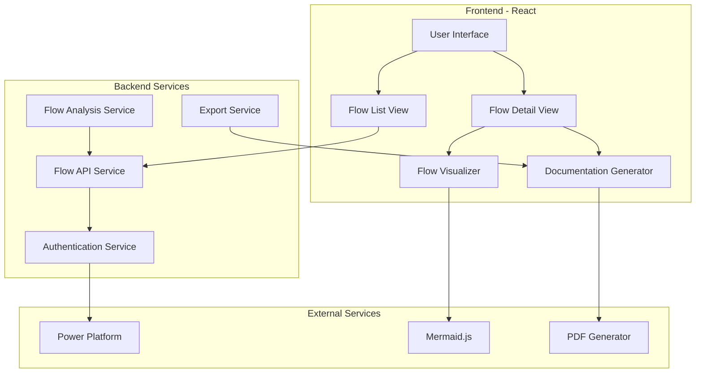
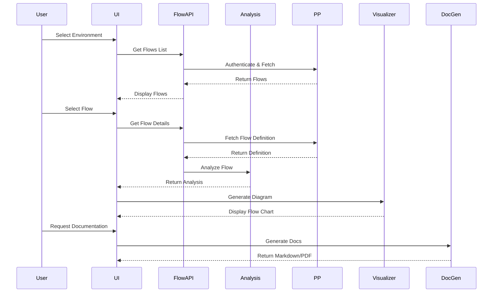
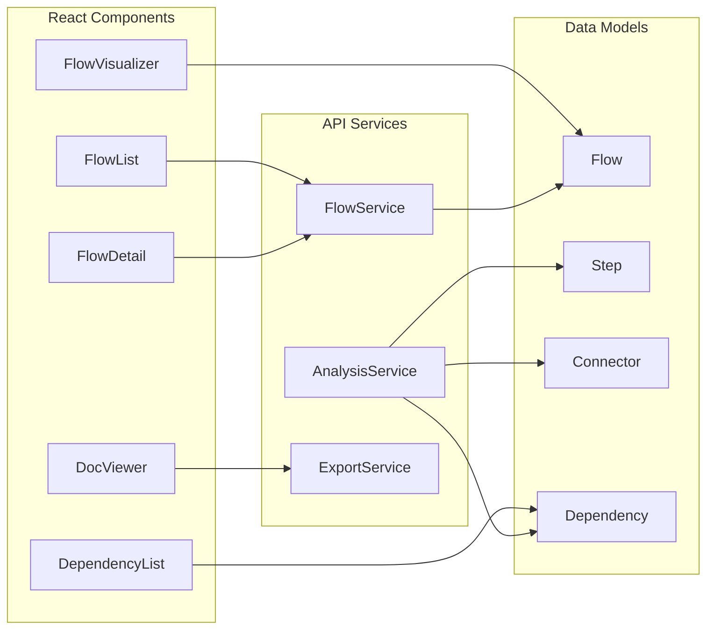
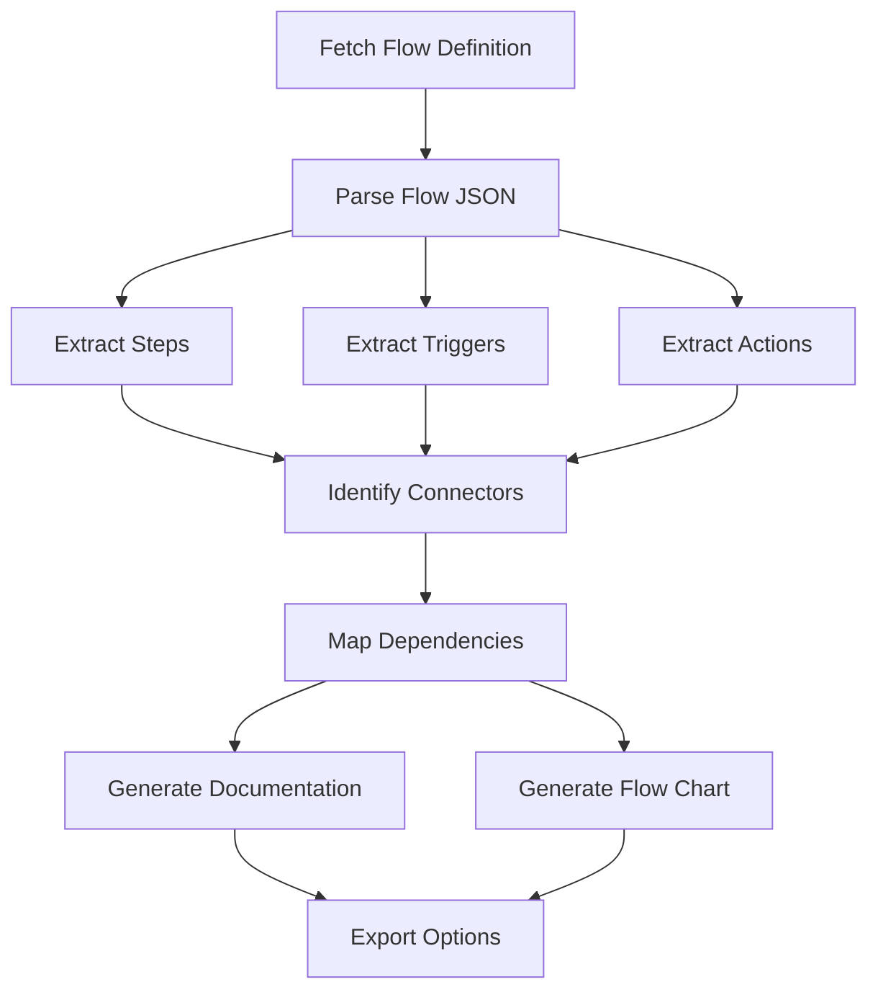
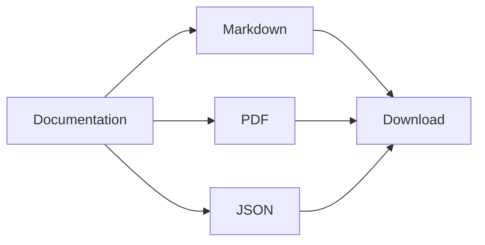

# Power Automate Flow Analyzer & Documenter Architecture

## System Architecture

```mermaid
graph TB
    subgraph Frontend[Frontend - React]
        UI[User Interface]
        FlowList[Flow List View]
        FlowDetail[Flow Detail View]
        Visualizer[Flow Visualizer]
        DocGen[Documentation Generator]
    end

    subgraph Backend[Backend Services]
        Auth[Authentication Service]
        FlowAPI[Flow API Service]
        Analysis[Flow Analysis Service]
        Export[Export Service]
    end

    subgraph External[External Services]
        PP[Power Platform]
        Mermaid[Mermaid.js]
        PDF[PDF Generator]
    end

    UI --> FlowList
    UI --> FlowDetail
    FlowDetail --> Visualizer
    FlowDetail --> DocGen
    
    FlowList --> FlowAPI
    FlowAPI --> Auth
    Auth --> PP
    
    Analysis --> FlowAPI
    Export --> DocGen
    
    Visualizer --> Mermaid
    DocGen --> PDF
```

## Data Flow

```mermaid
sequenceDiagram
    participant User
    participant UI
    participant FlowAPI
    participant Analysis
    participant PP
    participant Visualizer
    participant DocGen

    User->>UI: Select Environment
    UI->>FlowAPI: Get Flows List
    FlowAPI->>PP: Authenticate & Fetch
    PP-->>FlowAPI: Return Flows
    FlowAPI-->>UI: Display Flows

    User->>UI: Select Flow
    UI->>FlowAPI: Get Flow Details
    FlowAPI->>PP: Fetch Flow Definition
    PP-->>FlowAPI: Return Definition
    FlowAPI->>Analysis: Analyze Flow
    Analysis-->>UI: Return Analysis

    UI->>Visualizer: Generate Diagram
    Visualizer-->>UI: Display Flow Chart

    User->>UI: Request Documentation
    UI->>DocGen: Generate Docs
    DocGen-->>UI: Return Markdown/PDF
```

## Component Structure

```mermaid
graph LR
    subgraph Components[React Components]
        FlowList[FlowList]
        FlowDetail[FlowDetail]
        FlowVisualizer[FlowVisualizer]
        DependencyList[DependencyList]
        DocViewer[DocViewer]
    end

    subgraph Services[API Services]
        FlowService[FlowService]
        AnalysisService[AnalysisService]
        ExportService[ExportService]
    end

    subgraph Models[Data Models]
        Flow[Flow]
        Step[Step]
        Connector[Connector]
        Dependency[Dependency]
    end

    FlowList --> FlowService
    FlowDetail --> FlowService
    FlowVisualizer --> Flow
    DependencyList --> Dependency
    DocViewer --> ExportService

    FlowService --> Flow
    AnalysisService --> Step
    AnalysisService --> Connector
    AnalysisService --> Dependency
```

## Flow Analysis Process

```mermaid
graph TD
    A[Fetch Flow Definition] --> B[Parse Flow JSON]
    B --> C[Extract Steps]
    B --> D[Extract Triggers]
    B --> E[Extract Actions]
    
    C --> F[Identify Connectors]
    D --> F
    E --> F
    
    F --> G[Map Dependencies]
    G --> H[Generate Documentation]
    G --> I[Generate Flow Chart]
    
    H --> J[Export Options]
    I --> J
```

## Export Options

```mermaid
graph LR
    A[Documentation] --> B[Markdown]
    A --> C[PDF]
    A --> D[JSON]
    
    B --> E[Download]
    C --> E
    D --> E
``` 